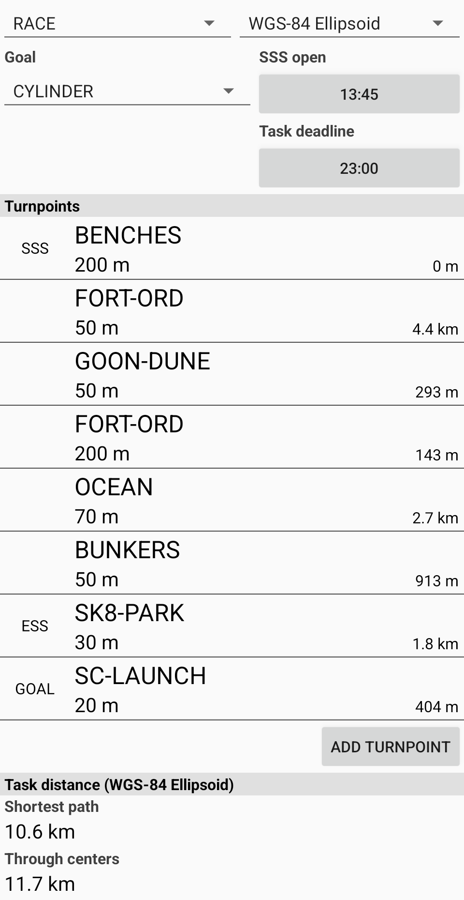

# XCTrack Task Tutorial

This document is meant to provide some low-level introduction to paragliding tasks and managing them. All within
the [XCTrack](https://xctrack.org/) app.

# Definitions

- **Waypoint**: Basically a point in space. Latitude + Longitude + Altitude
- **Task**: At it's most basic, an ordered series of waypoints, each with a defined radius. The waypoint + radius
  defines a cylinder that extends from the ground all the way up. When flying a task, you are flying from one of these
  cylinders to the next in the defined order.
- **Turnpoint**: A waypoint within a task and it's associated radius. When you are flying and get to a point where you
  are _radius_ distance away from your current waypoint, you can turn and head towards the next waypoint. That's why it'
  s referred to as a turnpoint.
- **SSS**: Start Speed Section. Basically the starting point of the race. To start, you need to be inside the SSS
  cylinder (circle made up of the waypoint and the defined radius) and pass through the cylinder wall (to the outside of
  the cylinder) _after_ the start time.
- **ESS**: End Speed Section. This is the end of "racing". Basically, hit this waypoint as fast as you possibly can, and
  then you can chill. it doesn't matter how long you take to get from ESS to goal. But you do have to get to goal.
- **goal**: The final waypoint (and radius... ie cylinder) of the race. The second to last waypoint is usually ESS and
  the time it takes you to get from ESS to goal does not factor into your race time.

# Loading waypoint files

Load the file into your [XCTrack](https://xctrack.org/) app.

1. Open XCTrack
2. Pull down from the top and hit `Navigation`

   

3. If a list of waypoints shows up, hit `cancel`
4. Click the little flag button on the top

   

5. Select the `Files` tab
6. Click the download button in the top right
    - Skip this and the next step if you dropped the file directly into
      `/Android/data/org.xcontest.XCTrack/files/Waypoints`

   

7. Find your file and select it
    - I usually select the file from google drive
8. Now you can select/de-select waypoint files as desired
9. Hit the back arrow
10. You should now see waypoints!

    

# Building a task

Sometimes you are the one defining the task. And sometimes someone gives you a simple list of waypoints and radii that
you need to manually enter into your device as a task (like [this](../sandcity/sand-city-task-1.txt). Or hell, sometimes
someone gives you [a QR code for the task](screenshots/sand-city-task-1-QR-code.png) and you can skip most of this.

1. From the main XCTrack screen, swipe down and select `Navigation`
2. Select `Competition Task` from the main naviation screen

   

3. Add turnpoint
4. Choose Waypoint
5. Set radius kilometers and/or meters
6. Repeat 3-6 for all the turnpoints
7. Set SSS, ESS, and Goal waypoints
8. Hit the back button
9. Set `SSS open`
    - This is the start time
    - Get in the air before this
    - Note that you have to be inside this start cylinder and cross out of it _after_ the start time
10. Set `Task deadline`
    - Not very common for sprint league, just set it to sunset or something later than you'll be flying
11. At this point, you should check the task distance with other pilots that also entered the task

    

12. :warning: It is highly recommended at this point to save the task to file
    - I have had the fun experience of launching and realizing that I no longer had the task loaded in xctrack. If you
      save it to a file, you can probably re-load it while flying.
    - [Example of a saved task](../sandcity/sand-city-task-1.xctsk)
13. If other pilots are with you, may also want to his `Share task` | `Display QR code` and then they can load the task
    directly from your phone via their camera.

    

14. Hit the back button twice and you are now waiting for the SSS open time and the start of the race!
