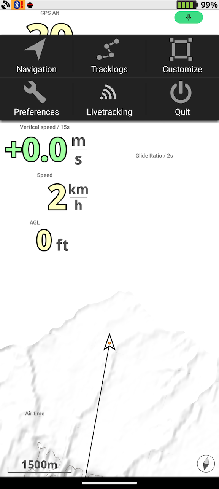
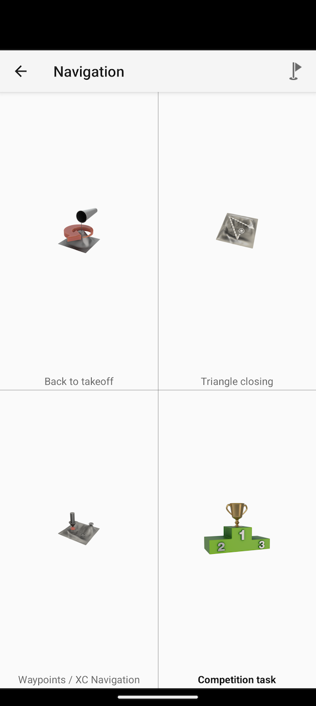
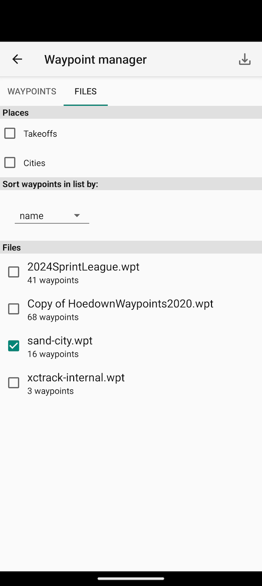
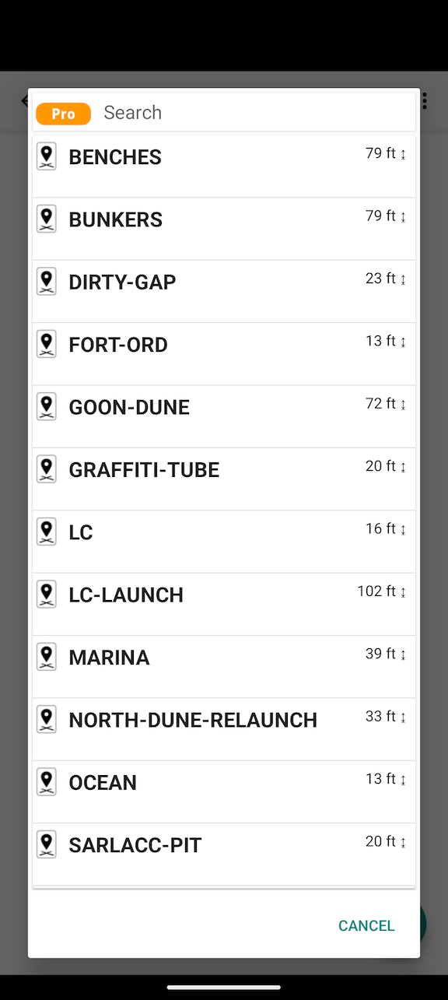
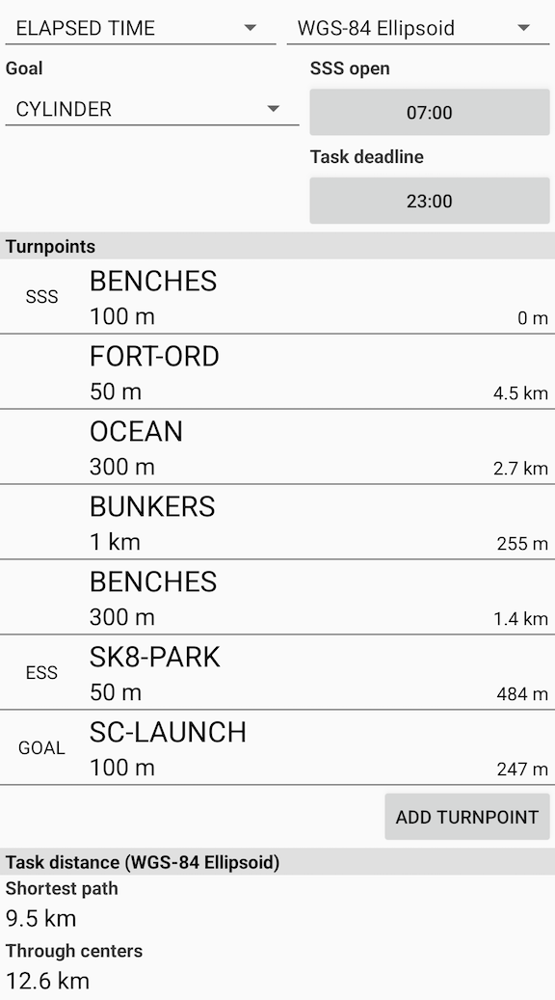
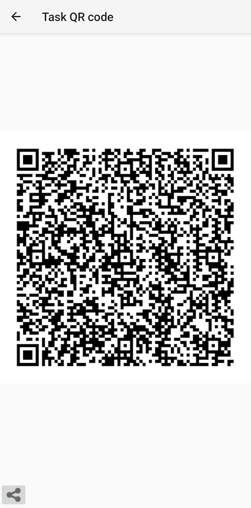

# Sand City Paragliding

The idea here is to document how to create waypoint files that can be imported into xctrack and provide waypoints for
Sand City and Marina. The ultimate goal is to teach newer XC pilots how to navigate and complete tasks.

# How to create and import waypoint files

- Create a project in [google earth](https://earth.google.com/) and drop pins where you want them
  -For example, my [sand city project](https://earth.google.com/earth/d/1X3ToC1Kt2kLXc0vw8LZcZgNbkZDY9afE?usp=sharing)
- Export as `KML` file
- Run the `converter` to convert the KML file to a `.wpt` waypoint file
    1. install [uv](https://github.com/astral-sh/uv)
    2. `uv run main.py convert --help`
    3. `uv run main.py convert --source [full path to .kml file] --destination [full path to output .wpt file]`
- Transfer the waypoint file to your phone
    - I usually put the file in a google drive folder
    - If you wanna use Android File Transfer or some other tool, drop it directly into
      `/Android/data/org.xcontest.XCTrack/files/Waypoints`
- Load the file into [xctrack](https://xctrack.org/)
    - Open XCTrack
    - Pull down from the top and hit `Navigation`
        
    - If a list of waypoints shows up, hit `cancel`
    - Click the little flag button on the top
        - 
    - Select the `Files` tab
    - Click the download button in the top right
        - Skip this if you dropped the file directly into `/Android/data/org.xcontest.XCTrack/files/Waypoints`
        - 
    - Find your file and select it
        - I usually select the file from google drive
    - Now you can select/de-select waypoint files as desired
    - Hit the back arrow
    - You should now see waypoints!
        - 
    - You can select one to start building a task

# Building a task

## definitions

- **Waypoint**: Basically a point in space. Latitude + Longitude + Altitude
- **Task**: At it's most basic, an ordered series of waypoints
- **SSS**: Start Speed Section. Basically the starting point of the race. Go go speed racer.
- **ESS**: End Speed Section. This is the end of "racing". Basically, hit this waypoint as fast as you possibly can, and
  then you can chill. it doesn't matter how long you take to get from ESS to goal. But you do have to get to goal.
- **goal**: The final waypoint of the race. The second to last waypoint is usually ESS and the time it takes you to get
  from ESS to goal does not factor into your race time.

## Building the task

1. From the main XCTrack screen, swipe down and select `Navigation`
2. Select `Competition Task` from the main naviation screen

3. Add turnpoint
4. Choose Waypoint
5. Set radius kilometers an dmeters
6. Repeat 3-6 for all the turnpoints
7. Set SSS, ESS, and Goal waypoints
8. Hit the back button
9. Set `SSS open`
    - This is the start time
    - Get in the air before this, but you have to tag the SSS waypoint at our after this time
10. Set `Task deadline`
    - Not very common for sprint league, just set it to sunset or something later than you'll be flying
11. At this point, you should check the task distance with other pilots that also entered the task

12. :warning: It is highly recommended at this point to save the task to file
    - I have had the fun experience of launching and realizing that I no longer had the task loaded in xctrack. If you
      save it to a file, you can probably re-load it while flying.
    - [Example of a saved task](./sand-city-task-1.xctsk)
13. If other pilots are with you, may also want to his `Share task` | `Display QR code` and then they can load the task
    directly from your phone via their camera.

14. Hit the back button twice and you are now waiting for the SSS open time and the start of the race!
